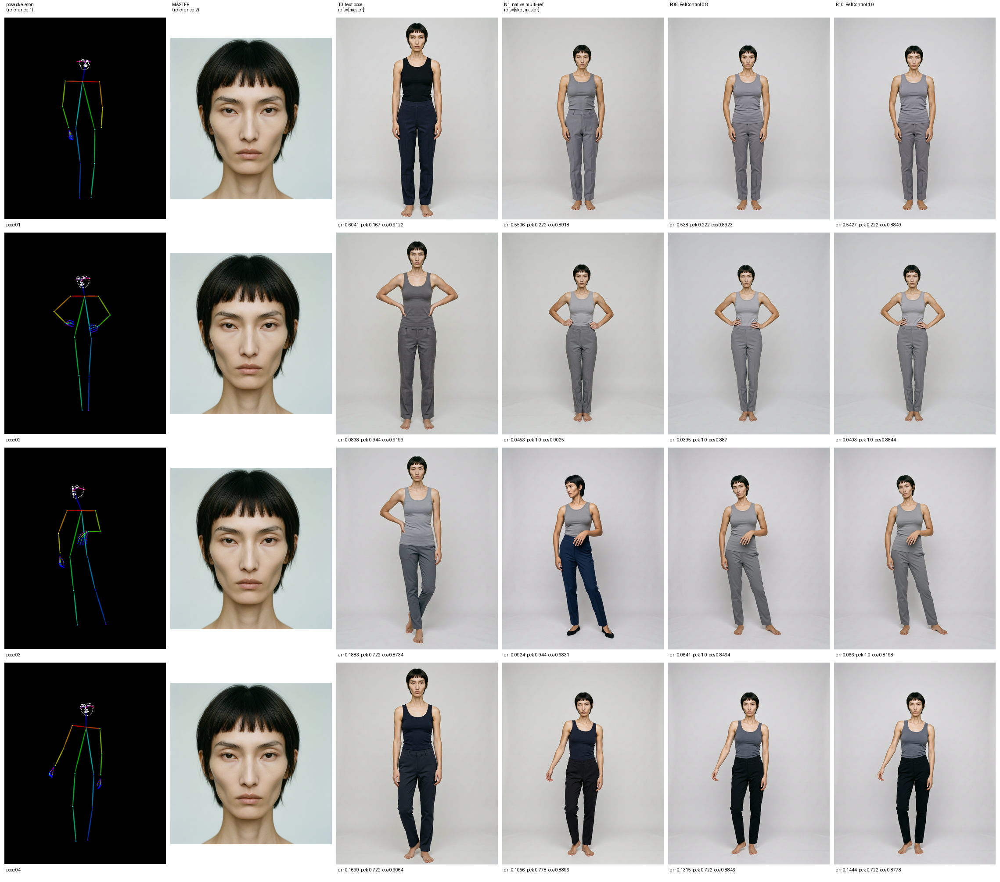
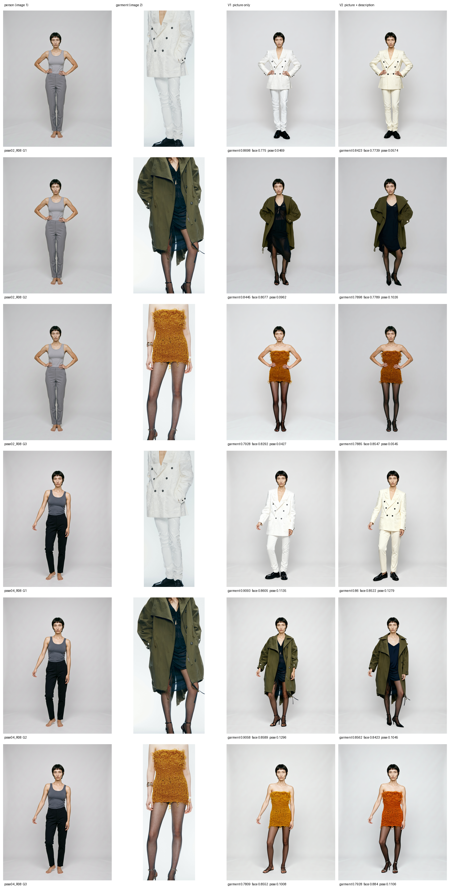
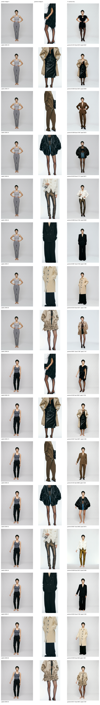

# MÜNN 모델컷 — 포즈 제어 & 가상 피팅 실험

**내부 자료.** MÜNN 26FW 공식 룩북에서 파생된 이미지가 포함되어 있어 공개 배포 대상이 아닙니다.

실행 2026-09-13 · NVIDIA H100 1장 · 생성 56장 (실패 0건)

---

## 다루는 질문 두 가지

1. **FLUX.2에서 포즈를 바꿀 때 얼굴을 어떻게 유지하는가**
2. **Qwen 다중 레퍼런스 모델로 가상 피팅(VTON)이 되는가**

📄 **[전체 보고서 →](reports/pose_vton_2609/README.md)**

---

## 1. FLUX.2 포즈 전환 + 아이덴티티 유지

Black Forest Labs는 FLUX.2용 ControlNet을 배포하지 않았습니다. 공식 안내는 **다중 레퍼런스 채널로 구조를 넣는 것** — 포즈를 이미지 1, 아이덴티티를 이미지 2로 주고 프롬프트에서 역할을 지정합니다. 그 위에 `FLUX.2-klein-base-9B` 전용으로 학습된 **RefControl LoRA**(Apache-2.0, rank 32)를 얹었습니다.

구조 레퍼런스는 룩북 사진이 아니라 **DWPose 스켈레톤**입니다. 관절 좌표만 담기므로 실제 모델의 외모가 조건에 들어갈 경로가 없습니다.

### 결과 (정면 포즈 3개, T0 대비)

| 조건 | 포즈 오차 ↓ | 얼굴 평균 ↑ | **최악값** ↑ |
|---|---|---|---|
| T0 텍스트만 (기존 방식) | 기준 | 0.900 | 0.873 |
| N1 스켈레톤만 | −40% | 0.825 | **0.683** ← 붕괴 |
| **R08 RefControl 0.8** | **−42%** | **0.873** | **0.846** |
| R10 RefControl 1.0 | −38% | 0.861 | 0.820 |

**R08 채택.** 평균이 아니라 **최악값**에서 갈립니다. 스켈레톤만 넣으면 포즈는 잡히지만 한 케이스에서 얼굴이 0.683까지 무너지고, RefControl 0.8이 그걸 0.846으로 되돌리면서 포즈는 오히려 더 정확합니다.



행 = 포즈, 열 = 조건. 왼쪽 두 칸이 모델에 넣은 두 레퍼런스(스켈레톤 / Master)입니다.
얼굴만 확대한 시트는 [face_sheet.png](outputs/pose_pilot/v1/face_sheet.png) — 전신 프레임에서 얼굴은 약 110px이라 축소판으로는 판단이 안 됩니다.

### 찾은 실패: 앞/뒤 방향은 스켈레톤에 실리지 않는다

`pose01`은 원본이 **뒷모습**인데 네 조건 모두 정면 인물을 만들었습니다. 좌우 라벨 뒤집힘 가능성을 배제하려고 미러 불변 지표(x 반전 + 좌우 관절 교환)를 넣었으나 0.6041 → 0.6038로 거의 변하지 않았습니다 — 실제 실패입니다.

근거: 해당 레퍼런스만 어깨 부호가 음수(−0.212)이고, 얼굴 관절 신뢰도가 낮으며(nose 0.614 vs 나머지 0.90–0.93), **귀 신뢰도가 눈보다 높습니다**(0.709 > 0.579) — 뒤통수를 본 검출기의 전형적 서명입니다.

---

## 2. Qwen-Image-Edit-2511 다중 레퍼런스 VTON

`QwenImageEditPlusPipeline`, Apache-2.0, 레퍼런스 최대 3장. **try-on LoRA·마스크·워핑 없이 스톡 모델 그대로 40/40 성공.**

> `Qwen-Image-2512`가 더 최신이지만 `QwenImagePipeline` — 순수 T2I라 이미지 입력이 안 됩니다.

인물은 1부의 R08 출력을 썼으므로 **Master → FLUX.2 포즈 제어 → Qwen VTON** 전체 체인입니다.
의상은 룩북에서 **DWPose 목 관절 아래를 잘라** 얼굴을 제거했고, 자른 뒤 검출기를 다시 돌려 검증했습니다 — 원본 1~4개 검출 → **크롭 전부 0개**.

### 프롬프트: 사진만 주는 쪽이 낫다

| 프롬프트 | 의상 일치 ↑ | 얼굴 유지 ↑ | 포즈 유지 ↓ |
|---|---|---|---|
| **V1 사진만** | **0.851** | 0.831 | **0.088** |
| V2 사진 + 설명문 | 0.822 | 0.831 | 0.093 |

**설명문을 붙이면 의상 일치가 떨어집니다.** 텍스트가 사진의 구체적 디테일을 일반적 서술 쪽으로 끌어당깁니다.



### 커버리지 — 의상 11벌



| 의상 | 일치도 | 의상 | 일치도 |
|---|---|---|---|
| G11 트렌치+레더스커트 | 0.930 | G6 골드 메탈릭 팬츠 | 0.836 |
| G8 크림 부클레 롱코트 | 0.928 | G7 핀스트라이프 수트 | 0.833 |
| G2 올리브 밀리터리 코트 | 0.906 | G3 앰버 니트 미니 | 0.801 |
| G9 플로럴 아플리케 스커트 | 0.877 | G5 광택 봄버 | 0.749 |
| G1 크림 자카드 블레이저 | 0.874 | G10 프린지 드레스 | 0.535 |
| | | G4 카멜 오버사이즈 수트 | 0.338 |

### 실패 원인은 하나였습니다

낮은 3벌(G4·G5·G10)의 공통점은 **의상 레퍼런스가 정면이 아니라는 것**입니다. 의상 크롭 자체의 스켈레톤에서 어깨 부호로 정면성을 재면:

| 레퍼런스 | 개수 | 의상 일치 | 범위 |
|---|---|---|---|
| 정면 (facing ≥ 0.44) | 8벌 | **0.873** | 0.801–0.930 |
| 돌아섬 (facing < 0.44) | 3벌 | **0.541** | 0.338–0.749 |

**두 범위가 겹치지 않습니다.** Pearson r = 0.619인데 Spearman은 0.355 — 완만한 기울기가 아니라 **문턱 효과**입니다.

이는 1부에서 찾은 뒷모습 포즈 실패와 **같은 성질의 문제**입니다: 앞/뒤 방향 정보는 어느 채널로도 자동 전달되지 않습니다. 룩북에서 의상을 자동 수집할 때 어깨 부호로 정면 필터를 걸면 됩니다.

### 시드 재현성

| | 평균 편차 | 최악 |
|---|---|---|
| 의상 일치 | 0.062 | 0.150 |
| 얼굴 유지 | 0.044 | 0.065 |

얼굴은 시드에 거의 흔들리지 않습니다. 의상도 안정적이나 G3(스트랩리스 미니)만 0.150으로 튑니다 — 탱크톱에서 구조를 가장 크게 바꿔야 하는 케이스입니다.

---

## 저장소 구성

```
outputs/pose_pilot/v1/            FLUX.2 포즈 16장 + 컨택트시트 2종 + 지표
outputs/vton/qwen2511_v1/         VTON 1회차 12장 (의상 3 × 프롬프트 2)
outputs/vton/qwen2511_v2_breadth/ VTON 2회차 16장 (새 의상 8벌)
outputs/vton/qwen2511_v2_seeds/   VTON 2회차 12장 (시드 재현성)

data/pose_refs/munn26fw/          DWPose 스켈레톤 4장 + 키포인트
data/garments/munn26fw/           의상 크롭 11벌 (얼굴 0개 검증)
identities/MUNN26FW_A/            Master + 출처 기록
configs/vton_garments.json        의상 정의 — 여기 추가하면 확장됨

scripts/pose_pilot/               select_poses · generate_pose · evaluate_pose · build_sheets · dwpose_onnx
scripts/vton/                     prepare_garments · generate_vton · evaluate_vton · build_sheets
vendor/dwpose_onnx/               DWPose ONNX 전후처리 (IDEA-Research/DWPose, onnx 브랜치)
reports/pose_vton_2609/           전체 보고서
```

각 실험 폴더의 `manifest.json`에 프롬프트 원문·시드·보낸 레퍼런스 순서와 sha256이, `metrics_joined.json`에 이미지별 전체 지표가, `summary.txt`에 집계표가 들어 있습니다.

**파일명 규칙** — `pose04_R08__G8_V1.png` = 인물 `pose04_R08` / 의상 `G8` / 프롬프트 `V1`. 시드 런만 뒤에 `_s8801`이 붙습니다.

---

## 사용한 모델

| 용도 | 모델 | 라이선스 |
|---|---|---|
| 포즈 베이스 | `black-forest-labs/FLUX.2-klein-base-9B` | FLUX.2 비상업 |
| 포즈 어댑터 | `thedeoxen/refcontrol-FLUX.2-klein-9B-reference-pose-lora` | Apache-2.0 |
| VTON | `Qwen/Qwen-Image-Edit-2511` | Apache-2.0 |
| 포즈 검출 | DWPose (`yzd-v/DWPose`) | Apache-2.0 |
| 의상 유사도 | `facebook/dinov2-large` | Apache-2.0 |
| 얼굴 유사도 | InsightFace antelopev2 / glintr100 | 비상업 연구용 |

가중치는 이 저장소에 없습니다. `scripts/fetch_hf_repo.py`로 받습니다.

---

## 남은 것

- FLUX.2에는 브랜드 학습이 없어 **무드 축은 여전히 비교 불가**
- Master는 `operational_interim_master` — 업체 미승인 상태
- 뒷모습·측면 포즈는 별도 처리 필요
- 의상 레퍼런스 정면 필터는 §2의 발견으로 설계는 됐으나 파이프라인에 아직 안 붙임
